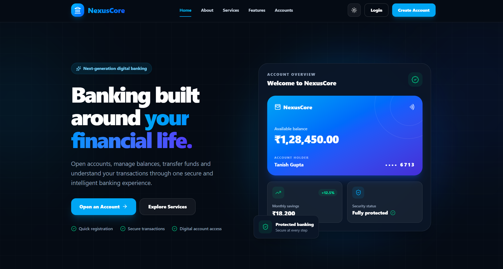
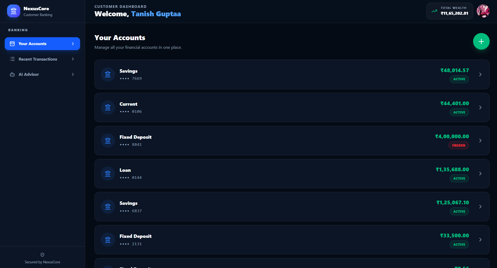
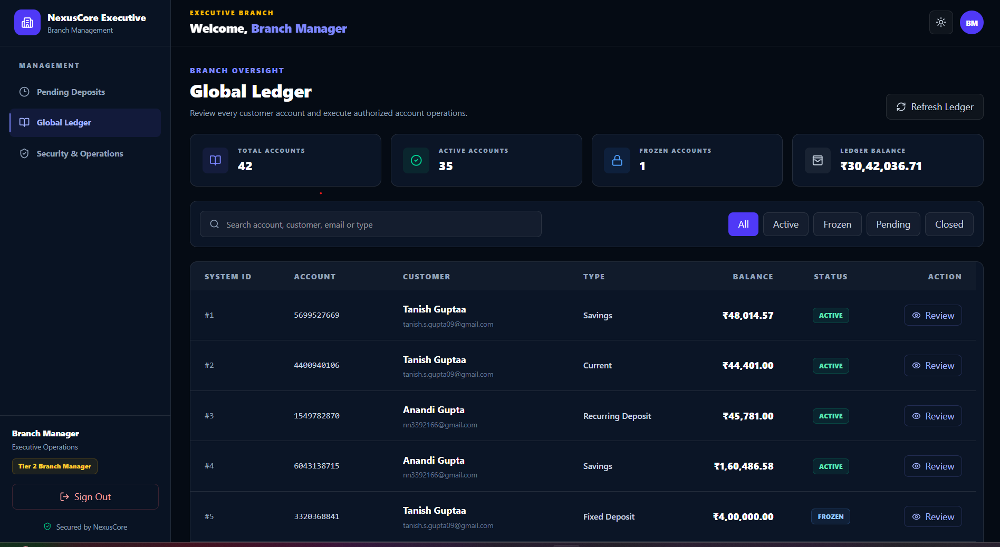

# NexusCore Bank & Mart

> A full-stack digital banking platform enabling secure deposits, withdrawals, and transactions across Savings, Current, FD, RD, and other account types. Includes an admin panel for user & liquidity management, and an AI chatbot that recommends account plans based on transaction history. Also NexusCore Mart in their Customers can shop and make payments to their nexuscore bank.

## Features

**For Customers**

- Secure deposit, withdrawal, and fund transfer transactions
- Complete transaction history tracking
- Multiple account types — Savings, Current, Fixed Deposit (FD),
  Recurring Deposit (RD), and more
- Account-specific perks and benefits
- AI-powered chatbot assistant that recommends and explains account
  plans based on the user's transaction history

**For Admins**

- User account management
- Bank liquidity monitoring and management
- Multi-bank management support

### Tech Highlights

- Secure, transaction-safe architecture for all monetary operations
- Role-based access for customers and admins
- AI chatbot integration for personalized account insights

## Tech Stack

**Backend**

- C# (.Net / ASP.NET Core, .NET 10.0)
- SQL Server (Database)
- SignalR (real-time updates)
- Custom JWT auth with server-side session revocation
- BCrypt (hashing password and OTP codes)
- RBAC (Role-Based Access Control) via policy-based authorization
- Google Auth (OAuth sign-in)
- Email Service via MailKit (notification, OTP)
- OTP verification (expiry, resend cooldown, max attempts)
- Audit logging
- Http Client (for different server connection)

**Frontend**

- React + Typescript
- React Router (routing)
- React Hook Form (form handling)
- Tailwind CSS (styling)
- Lucide React (icons)
- jsPDF + html2canvas (generating PDFs, e.g. reciepts)
- @microsoft/signalr (real-time client)

## Project Structure

```
├───NexusProject/
├───screenshots/
├───README.md
├───.gitignore
├───.gitattributes
├───NexusCoreBank/
│   ├───Frontend/
│   │   └───nexuscore-client/
│   │       ├───public/
│   │       └───src/
│   │           ├───assets/
│   │           ├───Components/
│   │           │   ├───admin/
│   │           │   ├───customer/
│   │           │   │   └───actions/
│   │           │   ├───employee/
│   │           │   ├───layout/
│   │           │   ├───manager/
│   │           │   └───ui/
│   │           ├───hooks/
│   │           ├───Pages/
│   │           │   ├───admin/
│   │           │   ├───customer/
│   │           │   ├───employee/
│   │           │   ├───manager/
│   │           │   └───public/
│   │           └───services/
│   └───NexusCore/
│       ├───AdminOperations/
│       ├───AiChatBotOperation.cs/
│       ├───CustomerOperations/
│       ├───Dto's/
│       │   ├───AccountDto's/
│       │   ├───AdminOperationDto's/
│       │   ├───AiChatBotDto's/
│       │   ├───CustomerOperationDto's/
│       │   ├───EmployeeDto's/
│       │   ├───InvoiceDto's/
│       │   └───ManagerDto's.cs/
│       ├───EmployeeOperation/
│       │   └───Approve/
│       ├───Hubs/
│       ├───ManagerOperation/
│       ├───Properties/
│       ├───Repositories/
│       │   ├───Enums/
│       │   └───Interfaces/
│       ├───ServerController/
│       └───Services/
└───NexusCoreMart/
    ├───Frontend/
    │   ├───public/
    │   └───src/
    │       ├───Components/
    │       │   ├───layout/
    │       │   └───product/
    │       ├───Pages/
    │       │   ├───admin/
    │       │   ├───checkout/
    │       │   ├───orders/
    │       │   ├───profile/
    │       │   └───public/
    │       ├───services/
    │       └───types/
    └───NexusMart/
        ├───BankOperation/
        ├───BankOperationDto/
        ├───CartOperation/
        ├───CartOperationDto/
        ├───CustomerOperation/
        ├───CustomerOperationDto/
        ├───LoginSignUpDto's/
        ├───LoginSignUpOperation/
        ├───OrderOperation/
        ├───OrderOperationDto/
        ├───Properties/
        ├───ServerController/
        └───wwwroot/
            └───images/
                └───ProductImages/
```

## Prerequisites

- [.NET SDK](https://dotnet.microsoft.com/download) (version 10.0 or higher)
- [Node.js](https://nodejs.org/) (version 10.9 or higher) and npm
- [SQL Server](https://www.microsoft.com/sql-server)

## Database

The full schema (tables, indexes, constraints) is defined in `TanishElectronics.sql` at the Backend folder root. Run the script against your SQL Server instance to set up the database, or use the EF Core migrations in `Backend/TanishElectronics.Api/Migrations/`.

## Screenshots

### Home Page



### Customer Dashboard



### Track Repair Status


### Branch Manager Dashboard



## Author

GitHub: [@Tanish15-gif](https://github.com/Tanish15-gif)
